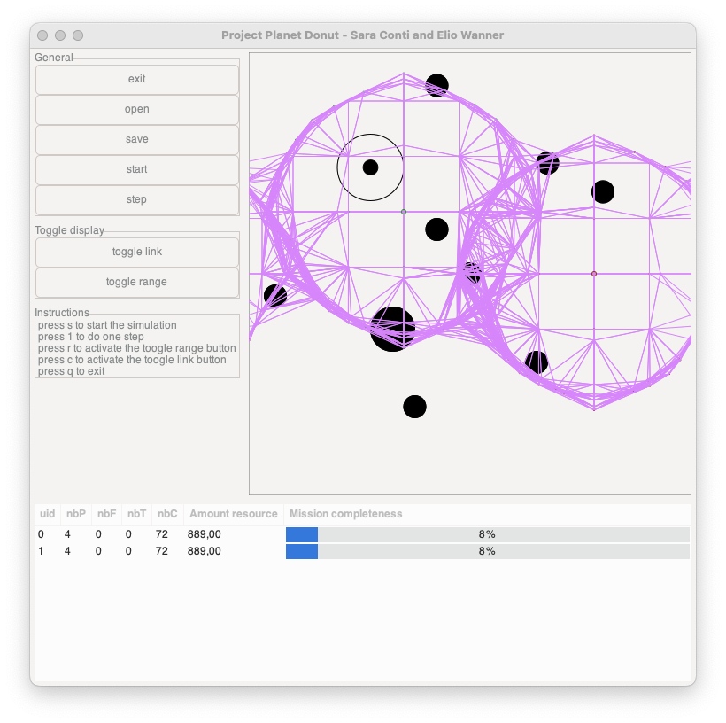

# Robot Exploration Simulation

This project was developed as a course project in 2021 to learn object-oriented programming in C++ at EPFL. It was completed in a group of two and simulates the deployment, exploration, and resource gathering by autonomous robots. The robots are tasked with mapping an area, identifying resources, and establishing a communication network.


## Key Features

- **Robot Deployment**: Robots are deployed in orthogonal directions (N, E, S, W) from the base. Communication robots support prospecting robots by extending their range.
- **Resource Gathering**: Prospecting robots identify resource deposits, triggering the creation of specialized robots for extraction and transport.
- **Communication Network**: Communication robots establish a network to keep prospecting robots connected to the base.
- **Robustness**: Adaptive strategies allow robots to explore diverse directions to maximize coverage and efficiency.

## Compilation and Execution

To compile the project, use the provided `makefile`:

```bash
make
```

Run the simulation with the provided test scenario:

```bash
./projet test_scenario.txt
```

## Authors

- Elio Wanner
- Sara Conti
